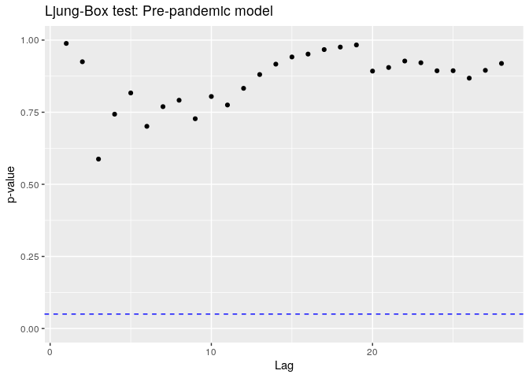

COVID-19 Air Quality: San Francisco
================
Cari Gostic
4/5/2020

``` r
library(tidyverse)
library(zoo)
```

    ## 
    ## Attaching package: 'zoo'

    ## The following objects are masked from 'package:base':
    ## 
    ##     as.Date, as.Date.numeric

``` r
library(lubridate)
```

    ## 
    ## Attaching package: 'lubridate'

    ## The following object is masked from 'package:base':
    ## 
    ##     date

``` r
library(forecast)
```

    ## Registered S3 method overwritten by 'quantmod':
    ##   method            from
    ##   as.zoo.data.frame zoo

``` r
library(broom)
library(tseries)
options(warn=-1)
```

## Introduction

San Francisco was the first city in the US to declare a shelter-in-place
ordinance. How has this drastic change in human activity impacted the
air quality in the city? To answer this question, I’ll examine how
ambient Nitrogen Dioxide \[NO2\] levels have changed from January 1st
through April 5th. My initial hypothesis based on my [monitoring
app](https://sf-aq-covid19.herokuapp.com/) is that the concentration of
NO2 has decreased on average, and that the weekly cycle has collapsed to
a smaller range.

#### Why Nitrogen Dioxide?

Most NO2 concentration that is measured in cities is a result of human
activity. Exhaust from automobiles accounts for up to 80% of urban NO2
pollution. Therefore, any significant change in NO2 concentration can be
reasonably linked to human behavior. On the other hand, fluctuations in
other common pollutants like Ozone and PM 2.5 might be caused by any
combination of wind, pressure, temperature, and other meteorological
factors in addition to human activity. I will therefore use NO2 as a
proxy for the effect of altered human behavor on air quality in general.

Source: [AU Government Air Quality Fact
Sheet](https://www.environment.gov.au/protection/publications/factsheet-nitrogen-dioxide-no2)

#### San Francisco COVID-19 Timeline

  - Jan 26: The first case of COVID-19 is confirmed in California
    (Orange County)
  - Feb 25: San Francisco declares a local emergency
  - Mar 02: California declares a state of emergency
  - Mar 11: San Francisco bans gatherings greater than 1,000 people, the
    WHO declares COVID-19 a global pandemic
  - Mar 12: San Francisco schools close
  - Mar 13: San Francisco bans gatherings greater than 100 people
  - Mar 15: California closes bars, clubs, and wineries. Allowed
    capacity at restaurants is reduced.
  - Mar 17: Shelter in Place enforced in San Francisco and neighboring
    counties

Source: [ABC 7
News](https://abc7news.com/timeline-of-coronavirus-us-coronvirus-bay-area-sf/6047519/)

## Analysis

### Data

All data comes from the [California Air Resources Board Open Data
Portal](https://www.arb.ca.gov/aqmis2/aqdselect.php)

The data set consists of hourly NO2 measurements from various sites in
the Bay Area. All measurements are in ppm. Visit the accompanying \[air
quality monitoring app\] to view a map of these sensors.

First, I’ll read in the data and remove NA values. There are 8 NA values
out of 2166 in this time series of NO2 measurements from January 1st
April 5th, 2020.

``` r
aq_2020 <- read_csv('data/NO2_PICKDATA_2020-4-5.csv')
```

``` r
# Drop NA values
aq <- aq_2020 %>% select(site, date, start_hour, value, variable, units, name) %>% drop_na()
aq %>% head()
```

    ## # A tibble: 6 x 7
    ##    site date       start_hour  value variable units            name             
    ##   <dbl> <date>          <dbl>  <dbl> <chr>    <chr>            <chr>            
    ## 1  2373 2020-01-01          0 0.0071 NO2      Parts Per Milli… San Francisco-Ar…
    ## 2  2373 2020-01-01          1 0.0175 NO2      Parts Per Milli… San Francisco-Ar…
    ## 3  2373 2020-01-01          2 0.0236 NO2      Parts Per Milli… San Francisco-Ar…
    ## 4  2373 2020-01-01          4 0.0207 NO2      Parts Per Milli… San Francisco-Ar…
    ## 5  2373 2020-01-01          5 0.0193 NO2      Parts Per Milli… San Francisco-Ar…
    ## 6  2373 2020-01-01          6 0.0216 NO2      Parts Per Milli… San Francisco-Ar…

I’ll focus on a single site in the heart of downtown, *San
Francisco-Arkansas Street*. Just the first few rows of data above reveal
that the hourly measurements are sporadic, so I’ll aggregate these
measurements to a daily average before creating a time series.

The code below converts the data to a weekly time series object.

``` r
# Select San Francisco-Arkansas Street
aq_sfas <- aq %>% filter(name == 'San Francisco-Arkansas Street')
# Group by date
aq_daily <- aq %>% group_by(date) %>% summarize(daily_avg = mean(value))
aq_daily_zoo <- zoo(aq_daily$daily_avg, strptime(aq_daily$date, format = '%Y-%m-%d'))
# Convert to time series (weekly frequency [7], starting on a Wednesday [4])
aq_ts <- ts(aq_daily_zoo, start = c(1,4), freq = 7)
```

### Exploratory Data Analysis

I’ll first do an exploratory analysis using a seasonal decomposition of
the time series.

``` r
stl_aq <- stl(aq_ts, 'periodic', t.window = 21)
autoplot(stl_aq, main = "Decomposition of NO2 concentration time series")
```


The trend component is calculated using the loess method over a 3-week
window. There is a clear downward trend in nitrogen dioxide
concentration starting in week 9 (the last week of February). This
coincides with San Francisco’s declaration of a local emergency. The WHO
declared COVID-19 a global pandemic in week 11, and San Francisco
enacted the shelter-in-place ordinance in week 12. The cyclical
component shows higher values of NO2 concentration during the work week,
likely due to increased commuter traffic, and low points on weekends
(particularly Sunday).

### Model

To examine how drastic the hypothesized decrease in air quality is, I’ll
separate the time series into pre-pandemic (training) and post-pandemic
(testing) series with a cutoff on March 11th. I am choosing March 11th
because this was the first day that the city of San Francisco placed an
ordinance that drastically altered human behavior (the ban of large
gatherings).

``` r
ts_pre <- ts(window(aq_daily_zoo, 
                    start = as.Date('2020-01-01'), 
                    end = as.Date('2020-03-11')), 
             start = c(1, 4), 
             freq = 7)
ts_post <- ts(window(aq_daily_zoo, start = as.Date('2020-03-11')), 
              start = c(1, 4), 
              freq = 7)
```

The code below finds the best-fit ARIMA model for the pre-pandemic time
series.

``` r
pre_model <- auto.arima(ts_pre)
pre_model
```

    ## Series: ts_pre 
    ## ARIMA(0,0,1)(1,0,1)[7] with non-zero mean 
    ## 
    ## Coefficients:
    ##          ma1    sar1     sma1    mean
    ##       0.4999  0.9172  -0.7375  0.0132
    ## s.e.  0.0992  0.1183   0.2139  0.0017
    ## 
    ## sigma^2 estimated as 2.478e-05:  log likelihood=276.38
    ## AIC=-542.76   AICc=-541.84   BIC=-531.45

The results indicate an MA(1) process with an MA(1) and AR(1) seasonal
component of period 7 (weekly). Below, a Ljung-Box test indicates that
the model is well-fit to the time series as there are no significant
p-values at the alpha=0.05 level (blue dotted line).

``` r
#' Creates a scatter plot of Ljung-Box p-values
#' calcualted from the residuals of a fit 
#' time series model
#'
#' @param model a fit time series model 
#'
#' @return a scatter plot of Ljung-Box p-values for lags 1-28
#'
#' @examples
#' auto_arima(aq_ts)
lj_plot <- function(model) {
  lags <- 1:28
  lj_values <- map_dbl(lags, function(i) Box.test(resid(model), lag = i)$p.value)
  
  ggplot() +
      geom_point(aes(x=lags, y=lj_values)) +
      ylim(0,1) +
      geom_hline(aes(yintercept=0.05), color = 'blue', linetype = 'dashed') +
      labs(title = 'Ljung-Box test: Pre-pandemic model', x = 'Lag', y = 'p-value')
}

lj_plot(pre_model)
```



### Are the post-pandemic values extreme?

Below, I forecast the 3 week post-pandemic period using the model
trained on the 10-week pre-pandemic
period.

``` r
forecast_df<- data.frame(date = aq_daily %>% filter(date > '2020-03-11') %>% select(date), 
                         forecast(pre_model, level = .95, h = 25))
df_plot <- merge(aq_daily, forecast_df, by = 'date', all = TRUE)
ggplot(df_plot) +
  geom_line(aes(date, daily_avg, color='Time Series')) +
  geom_line(aes(date, Point.Forecast, color = 'Forecast')) + 
  geom_ribbon(aes(date, ymin=Lo.95, ymax=Hi.95), 
              fill = 'red', 
              alpha = 0.2) +
  scale_color_manual("", values = c('red', 'blue')) +
  labs(title = 'NO2 Concentration and Forecast (based on Jan 1 - March 11th)', 
       y = 'Concentration (ppm)', 
       x = 'Date')
```


The predicted 95% confidence interval captures the true data for the
entire forecast, indicating that the true data is not wildly outside the
range of expected values predicted by the pre-pandemic model. However,
the model almost exclusively overestimates NO2 concentration in the
post-pandemic period. Though very small NO2 concentrations occurred
during the pre-pandemic period, these minima occurred almost exclusively
on Sundays. I’ll explore the topic of seasonality more in more detail
below.

### Change in average NO2 concentration

Using a Welch Student’s T-test to allow for different variances, I’ll
test the null hypothesis that the mean NO2 values are the same
pre-pandemic and post-pandemic.

``` r
tidy(t.test(ts_pre, ts_post))
```

    ## # A tibble: 1 x 10
    ##   estimate estimate1 estimate2 statistic  p.value parameter conf.low conf.high
    ##      <dbl>     <dbl>     <dbl>     <dbl>    <dbl>     <dbl>    <dbl>     <dbl>
    ## 1  0.00696    0.0134   0.00646      7.57 3.44e-11      88.0  0.00513   0.00879
    ## # … with 2 more variables: method <chr>, alternative <chr>

As hypothesized, I can reject the null hypothesis that the mean NO2
concentrations are not different, and I estimate that the mean
concentration has decreased by .0067 +/- 0.0019 ppm.

### Change in NO2 cycle

Earlier, I speculated that the cyclical nature of the NO2 time series
seemed to be collapsing. Below I’ll compare the mid-week values in pre-
and post-pandemic data sets.

``` r
ggsubseriesplot(ts_pre, 
                ylab = 'Concentration (ppm)', 
                main = 'Pre-pandemic in place NO2 concentration separated by Day') + 
  ylim(0,0.03)
```


``` r
ggsubseriesplot(ts_post, 
                ylab = 'Concentration (ppm)', 
                main = 'Post-pandemic in place NO2 concentration separated by Day') + 
  ylim(0,0.03)
```


**Experiments:**

  - **Pre weekday vs. Pre Weekend:** Compares average NO2 concentration
    during the pre-pandemic work-week to average NO2 concentration
    during the pre-pandemic weekend.
  - **Post weekday vs. Post Weekend:** Compares average NO2
    concentration during the post-pandemic work-week to average NO2
    concentration during the post-pandemic weekend.
  - **Pre Weekday vs. Post Weekday:** Compares average NO2 concentration
    during the pre-pandemic work-week to average NO2 concentration
    during the post-pandemic work-week.
  - **Pre Weekend vs. Post Weekend:** Compares average NO2 concentration
    during the pre-pandemic weekend to average NO2 concentration during
    the post-pandemic weekend.
  - **Pre Weekend vs. Post Weekday:** Compares average NO2 concentration
    during the pre-pandemic weekend to average NO2 concentration during
    the post-pandemic work-week.

<!-- end list -->

``` r
cyc <- cycle(ts_pre)
# separate time series into weekend (saturday and sunday) and weekday (monday-Friday)
weekend_pre <- ts_pre[cyc == 1 | cyc == 7]
weekday_pre <- ts_pre[cyc > 1 & cyc < 7]
cyc_post = cycle(ts_post)
weekend_post <- ts_post[cyc_post == 1 | cyc_post == 7]
weekday_post <- ts_post[cyc_post > 1 & cyc_post < 7]

# Welch's student t-test experiments (summarized in table)
weekday_comp <- tidy(t.test(weekday_pre, weekday_post))
weekend_comp <- tidy(t.test(weekend_pre, weekend_post))
pre <- tidy(t.test(weekday_pre, weekend_pre))
post <- tidy(t.test(weekday_post, weekend_post))

p_value <- map_dbl(c(pre$p.value, 
       post$p.value, 
       weekday_comp$p.value, 
       weekend_comp$p.value), ~ format(.x, scientific = FALSE) %>% as.numeric() %>% round(4))
diff_est <- map_dbl(c(pre$estimate, 
                      post$estimate, 
                      weekday_comp$estimate, 
                      weekend_comp$estimate), ~ round(.x, 4))

data.frame(experiment = c("Pre weekday vs. Pre Weekend",
                          "Post weekday vs. Post Weekend", 
                          "Pre Weekday vs. Post Weekday", 
                          "Pre Weekend vs. Post Weekend"),
           p_value = p_value,
           difference_estimate = diff_est)
```

    ##                      experiment p_value difference_estimate
    ## 1   Pre weekday vs. Pre Weekend  0.0000              0.0077
    ## 2 Post weekday vs. Post Weekend  0.1637              0.0021
    ## 3  Pre Weekday vs. Post Weekday  0.0000              0.0085
    ## 4  Pre Weekend vs. Post Weekend  0.0741              0.0029

I’ll use the Bonferroni method to adjust the standard significant alpha
value of 0.05 to 0.05/4 = 0.0125 based on the 5 comparisons computed on
the data set above. After this adjustment the only experiments with
significant results are: the **Pre Weekday vs. Pre Weekend**, confirming
that pre-pandemic average NO2 concentration is significantly higher
during the week than over the weekend, and **Pre Weekday vs. Post
Weekday**, meaning that mean work-week NO2 concentration is
significantly lower in the post-pandemic period.

These observations along with the non-significant results from the other
three experiments indicate that, as I mentioned during my initial
observations, the cyclical nature of the NO2 concentration time series
is compressing in the post-pandemic period. Though minimum weekly
values, still occurring on the weekends, remain unchanged, maximum
weekly values, still occurring during the work-week, are no longer
significantly different from weekend average concentration in the
post-pandemic period.

## Summary and conclusions

Overall, the mean concentration of Nitrogen Dioxide in San Francisco has
significantly decreased since March 11th, the day when San Francisco
enacted it’s first mandatory policy related to social distancing. Though
the magnitude of NO2 concentration is not wildly outside the range seen
in the pre-pandemic period, the weekly cycle of NO2 concentration has
perceptibly changed. In the pre-pandemic period, NO2 concentration
followed a weekly cycle that was likely related to commuter traffic.
Concentrations during the work-week were noticeably higher than on the
weekends. This new post-pandemic time series of NO2 concentration is
centered at a lower mean value, and work-week-level NO2 concentration is
no longer significantly different than weekend level. Though the
magnitude of the weekly minimum of NO2 concentration has not measurably
changed, the weekly maximum no longer predictably spikes as it did in
the pre-pandemic period. Self-quarantine and social distancing has
shifted NO2 concentrations in San Francisco into a state of perpetual
weekend.
